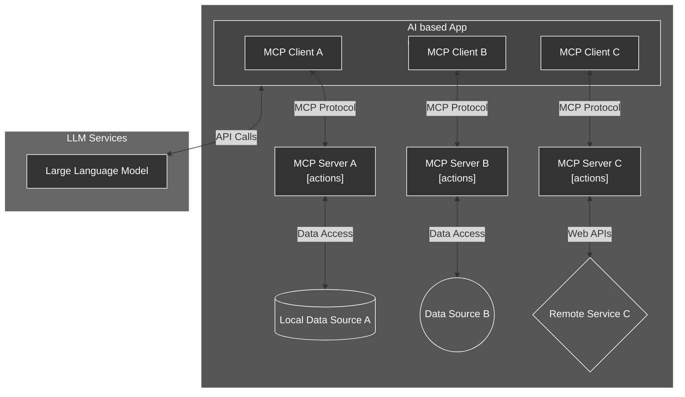

```mermaid
graph TB
    subgraph YourComputer[" "]
        subgraph AIbasedApp["AI based App<br>(Host)"]
            MCPClientA["MCP Client A"]
            MCPClientB["MCP Client B"]
            MCPClientC["MCP Client C"]
        end
        ServerA["MCP Server A<br>[actions]"]
        ServerB["MCP Server B<br>[actions]"]
        ServerC["MCP Server C<br>[actions]"]
        DSA[(Local Data Source A)]
        DSB((Data Source B))
        RemoteC{Remote Service C}
        
        MCPClientA <--> |MCP Protocol| ServerA
        MCPClientB <--> |MCP Protocol| ServerB
        MCPClientC <--> |MCP Protocol| ServerC
        
        ServerA <--> |Data Access| DSA
        ServerB <--> |Data Access| DSB
        ServerC <--> |Web APIs| RemoteC
    end
    
    subgraph LLMFrame["LLM Services"]
        LLM["Large Language Model"]
    end
    
    AIbasedApp <--> |API Calls| LLM
    
    style MCPClientA fill:#333,stroke:#fff,color:#fff
    style MCPClientB fill:#333,stroke:#fff,color:#fff
    style MCPClientC fill:#333,stroke:#fff,color:#fff
    style ServerA fill:#333,stroke:#fff,color:#fff
    style ServerB fill:#333,stroke:#fff,color:#fff
    style ServerC fill:#333,stroke:#fff,color:#fff
    style DSA fill:none,stroke:#fff,color:#fff
    style DSB fill:none,stroke:#fff,color:#fff
    style RemoteC fill:none,stroke:#fff,color:#fff
    style AIbasedApp fill:#444,stroke:#fff,color:#fff
    style YourComputer fill:#555,stroke:none,color:#fff
    style LLM fill:#333,stroke:#fff,color:#fff
    style LLMFrame fill:#666,stroke:none,color:#fff
``` 
