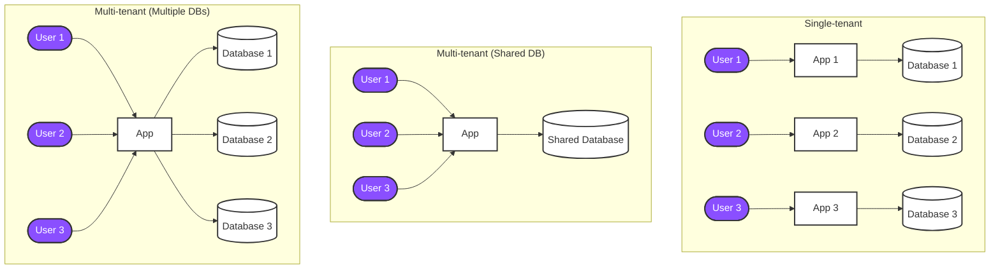

```mermaid
graph TD
    %% Single-tenant Architecture
    subgraph "Single-tenant"
    
    st_user1([User 1]) 
    st_user2([User 2])
    st_user3([User 3])
    
    st_app1[App 1]
    st_app2[App 2]
    st_app3[App 3]
    
    st_db1[(Database 1)]
    st_db2[(Database 2)]
    st_db3[(Database 3)]
    
    st_user1 --> st_app1
    st_user2 --> st_app2
    st_user3 --> st_app3
    
    st_app1 --> st_db1
    st_app2 --> st_db2
    st_app3 --> st_db3
    end
    
    %% Multi-tenant with Shared Database
    subgraph "Multi-tenant (Shared DB)"
    
    mt1_user1([User 1])
    mt1_user2([User 2])
    mt1_user3([User 3])
    
    mt1_app[App]
    
    mt1_db[(Shared Database)]
    
    mt1_user1 --> mt1_app
    mt1_user2 --> mt1_app
    mt1_user3 --> mt1_app
    
    mt1_app --> mt1_db
    end
    
    %% Multi-tenant with Multiple Databases
    subgraph "Multi-tenant (Multiple DBs)"
    
    mt2_user1([User 1])
    mt2_user2([User 2])
    mt2_user3([User 3])
    
    mt2_app[App]
    
    mt2_db1[(Database 1)]
    mt2_db2[(Database 2)]
    mt2_db3[(Database 3)]
    
    mt2_user1 --> mt2_app
    mt2_user2 --> mt2_app
    mt2_user3 --> mt2_app
    
    mt2_app --> mt2_db1
    mt2_app --> mt2_db2
    mt2_app --> mt2_db3
    end

classDef userClass fill:#8A4FFF,stroke:#333,stroke-width:2px,color:white;
classDef appClass fill:white,stroke:#333,stroke-width:2px;
classDef dbClass fill:white,stroke:#333,stroke-width:2px;
classDef titleClass fill:none,stroke:none,color:#333,font-weight:bold;

class st_user1,st_user2,st_user3,mt1_user1,mt1_user2,mt1_user3,mt2_user1,mt2_user2,mt2_user3 userClass;
class st_app1,st_app2,st_app3,mt1_app,mt2_app appClass;
class st_db1,st_db2,st_db3,mt1_db,mt2_db1,mt2_db2,mt2_db3 dbClass;
class st_title,mt1_title,mt2_title titleClass;
``` 